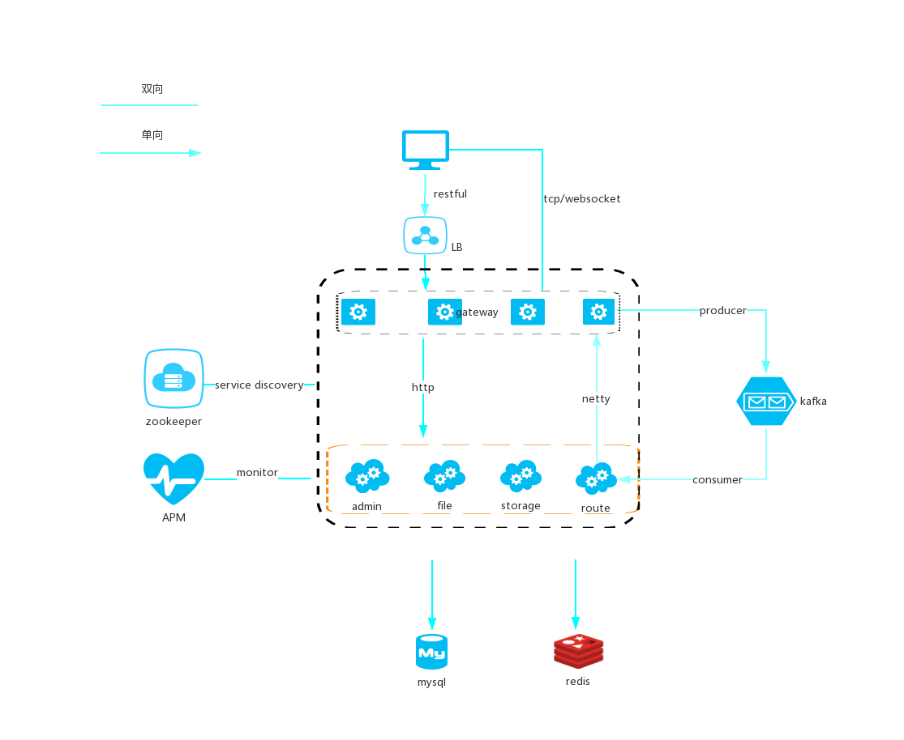
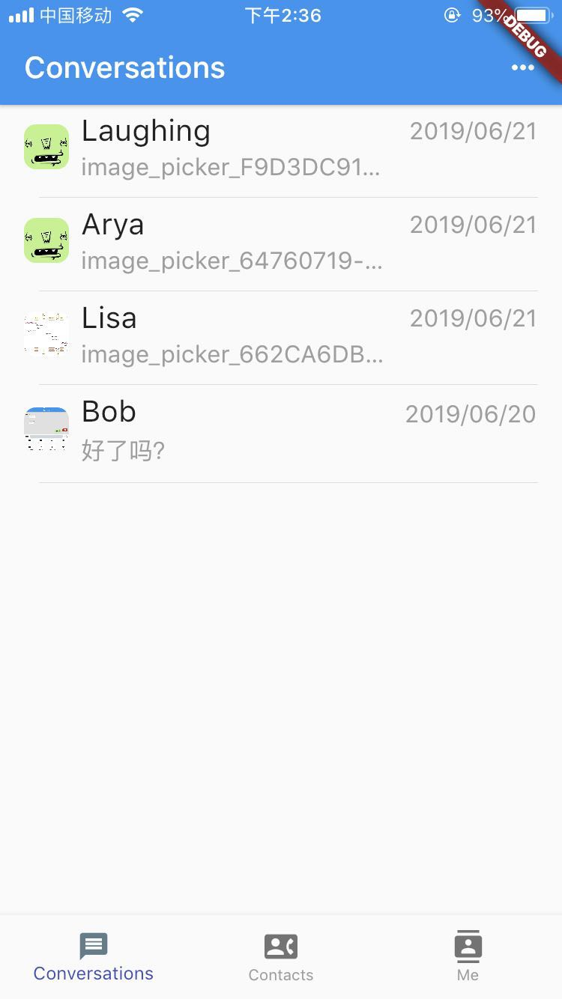
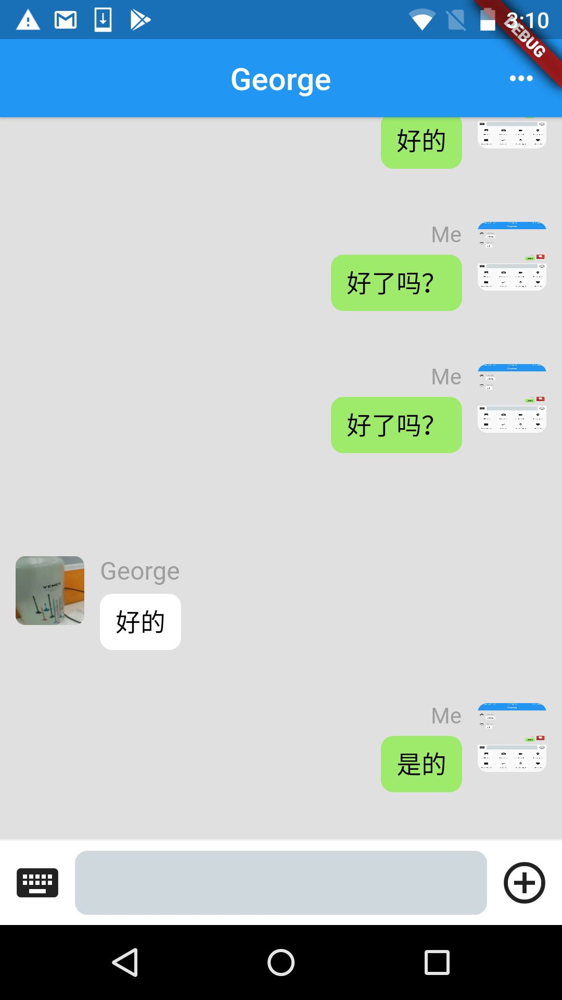
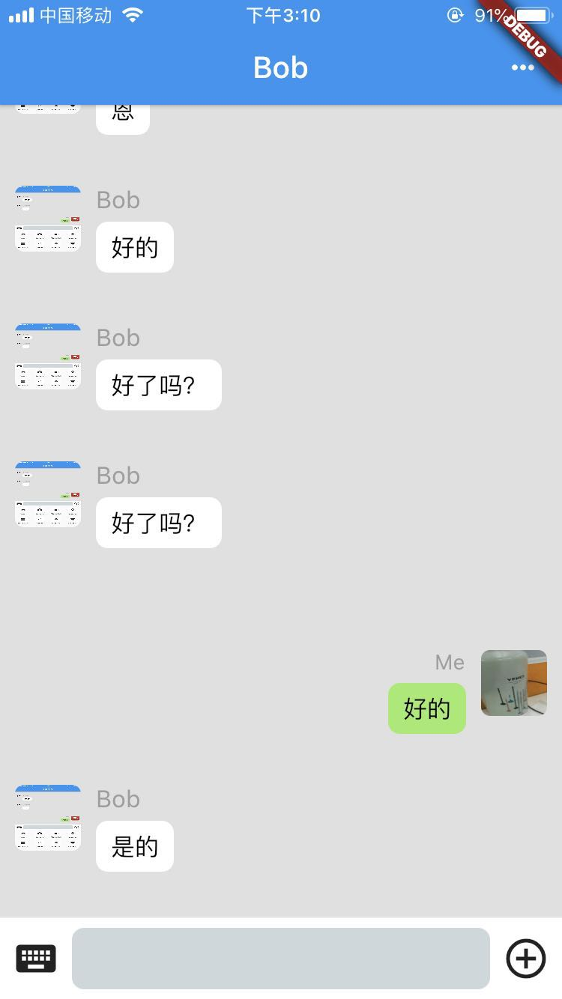
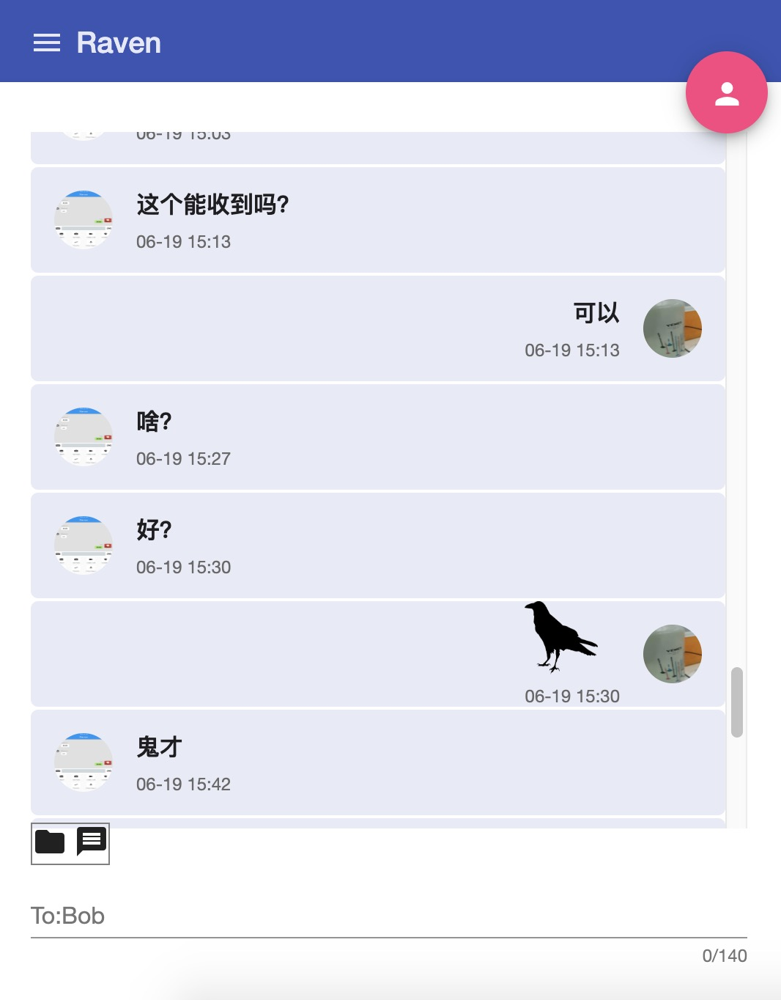

# raven

Open Source Instant Message System. 
It provides a solution that communicate between different platforms, such as Ios, Android and Web. It includes:

|  Repo   | Description  | Comment |
|  ----  | ----  | ----  |
| [Mobile Client](https://github.com/bbpatience/raven-client) | IOS and Android client |  by flutter |
| [Web Client](https://github.com/bbpatience/raven-web) | Web Client| by Angular |
| [App Server](https://github.com/bbpatience/raven-appserver) | Application Server deal with group and contacts things | by Spring boot |
| [IM Server](https://github.com/IamNotShady/raven) | IM Server | by Spring Cloud|


### Architecture




### Document

* Work flow
([Click Me](doc/DesignDoc/doc/process.md))
* Pressure Test Result
([Click Me](doc/PressureTestRecord/doc/2019.6.2-record.md)) 

### Demo

Demo: https://114.67.79.183     http://114.67.79.183


```
Test Account1:  13800222222, password: 222222
Test Account2:  13800333333, password: 333333
```

### Screen Shot
<div>




</div>

### Contact us
* zhou.xiaoxiao@outlook.com
* bbpatience@gmail.com
<div>

</div>