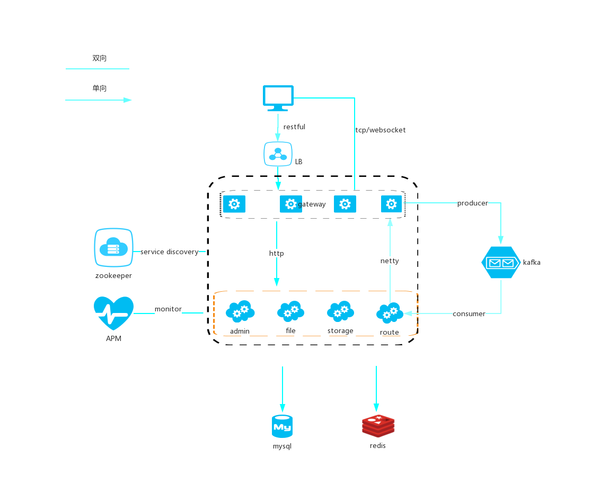
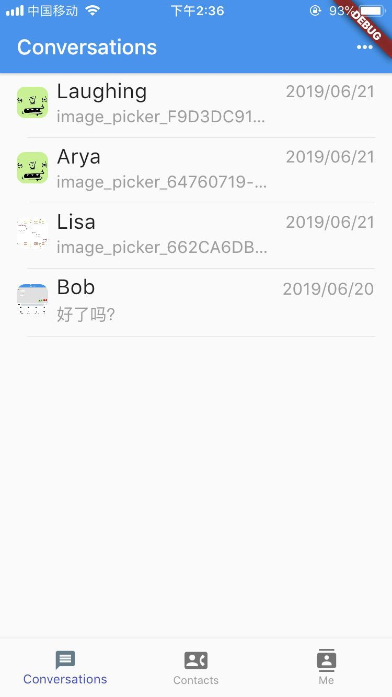
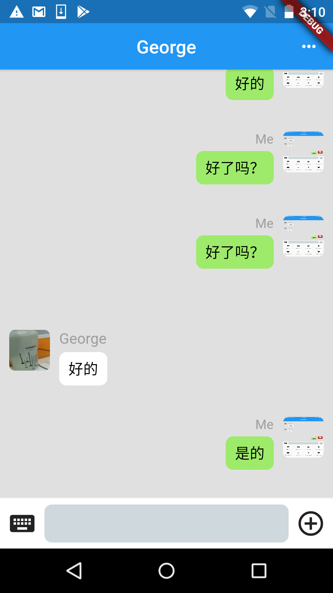
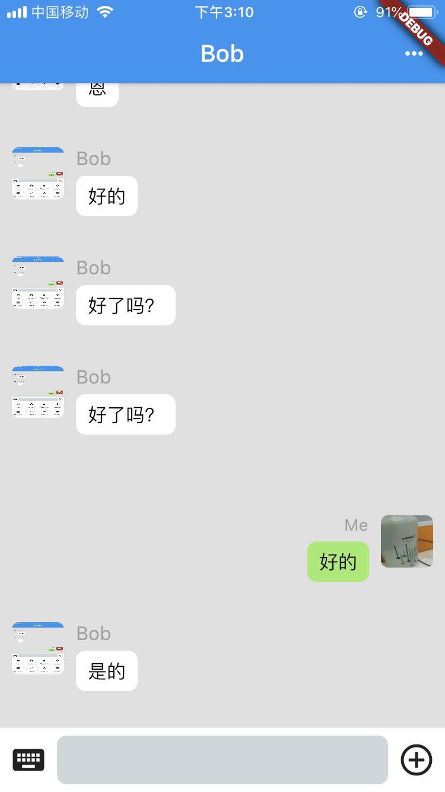
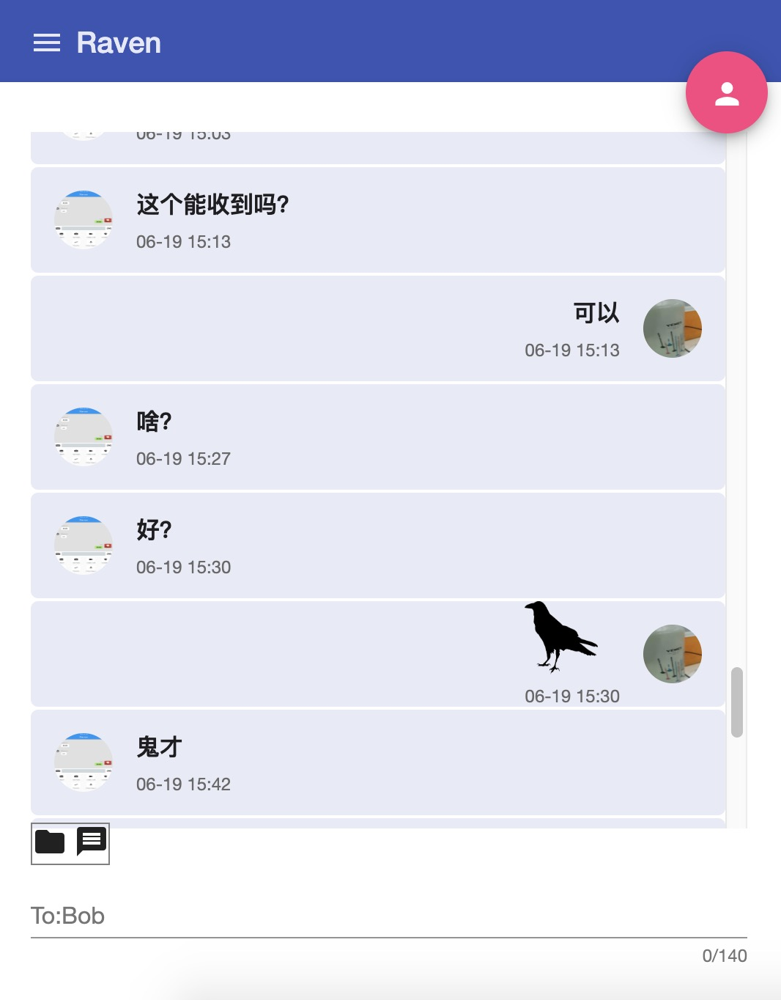

# Raven

Raven is an open-source instant messaging server built with Spring Boot and
Spring Cloud. It provides backend services for mobile and web clients,
including gateway access, message routing, group management, storage helpers,
and file upload support.

## Maintenance Status

Maintenance resumed in June 2026 after a dormant period. The current work is
focused on restoring a reproducible build, removing stale public setup
information, and defining a staged modernization path.

Raven is not currently presented as production-ready. The service architecture
depends on external infrastructure and the dependency stack still needs
incremental upgrades. See [MAINTENANCE.md](MAINTENANCE.md) for the active scope
and known limitations.

## Modules

| Module | Responsibility |
| --- | --- |
| `raven-admin` | Application configuration, gateway discovery, and group management APIs |
| `raven-common` | Shared models, protocol definitions, Netty helpers, and utilities |
| `raven-file` | FastDFS-backed file upload service |
| `raven-gateway` | Client-facing gateway and message producer |
| `raven-route` | Kafka-backed message routing and notifications |
| `raven-storage` | Redis-backed routing and conversation storage helpers |
| `raven-test` | Manual client and pressure-test utilities |

## Architecture



The original message-flow notes remain available in
[doc/DesignDoc/doc/process.md](doc/DesignDoc/doc/process.md).

## Infrastructure

Running the complete service stack requires:

- MySQL
- Redis
- Kafka
- Nacos
- ZooKeeper
- FastDFS for file uploads

The Maven verification build does not require these services:

```bash
mvn clean verify
```

## Related Clients

| Repository | Description | Technology |
| --- | --- | --- |
| [raven-client](https://github.com/bbpatience/raven-client) | iOS and Android client | Flutter |
| [raven-web](https://github.com/bbpatience/raven-web) | Web client | Angular |
| [raven-appserver](https://github.com/bbpatience/raven-appserver) | Application server for groups and contacts | Spring Boot |

## Historical Screenshots

<div>




</div>

## Contributing

Read [CONTRIBUTING.md](CONTRIBUTING.md) before opening a pull request. Keep
changes focused and include verification results.

## License

Raven is licensed under the [GNU General Public License v3.0](LICENSE).
