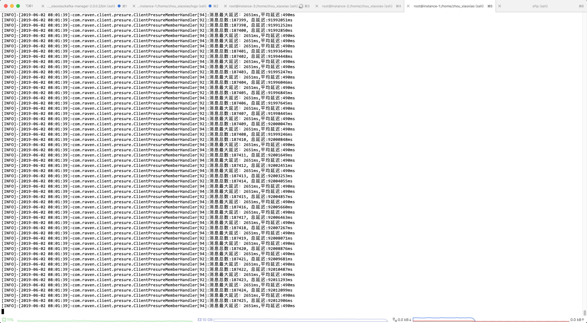
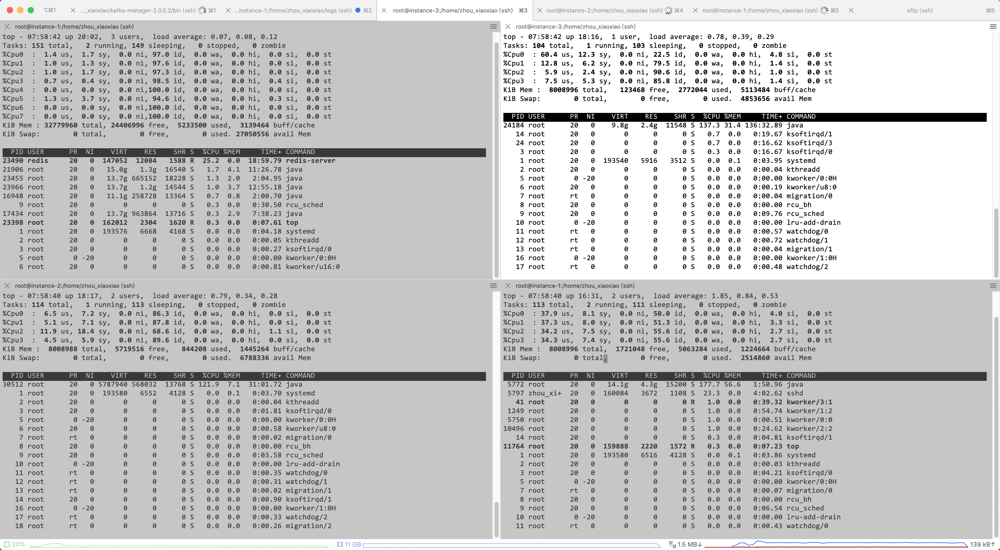
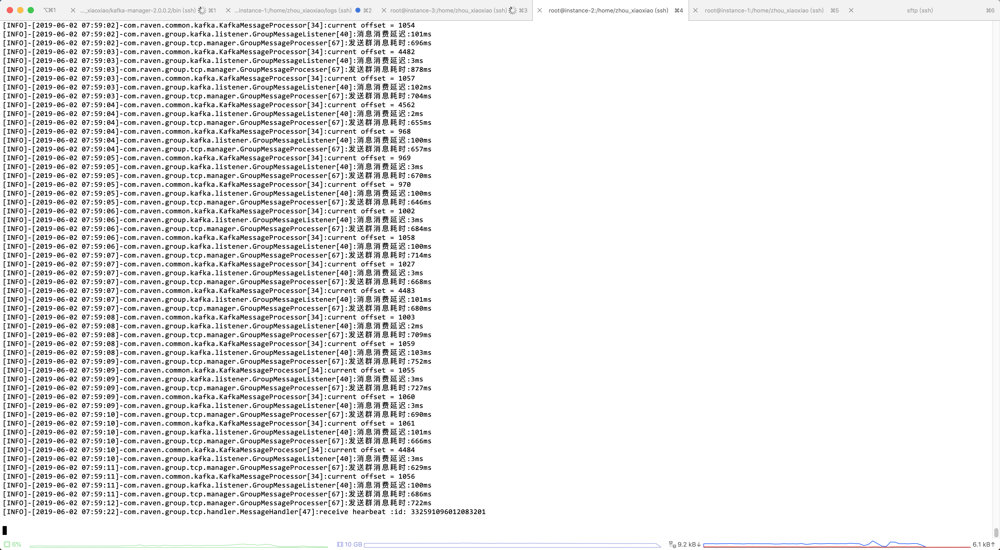
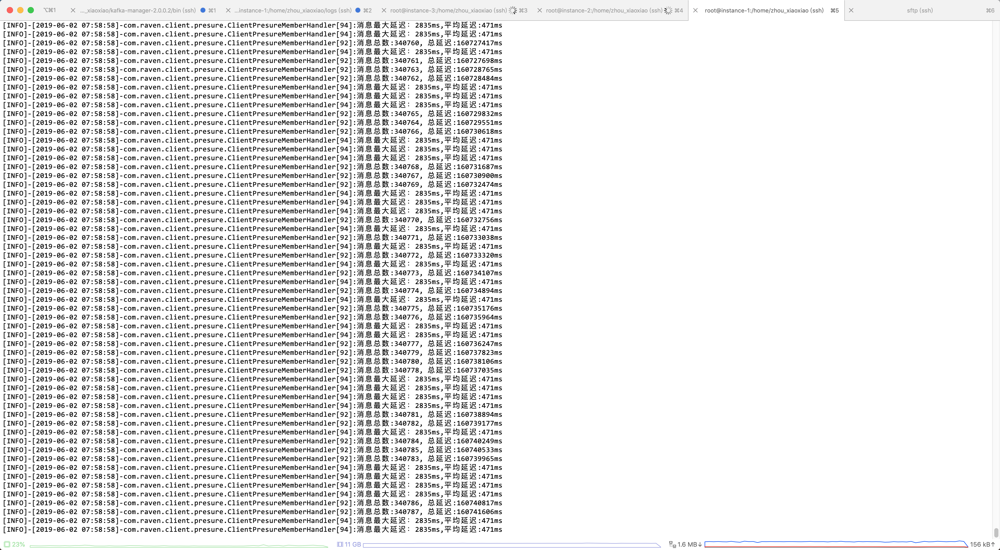
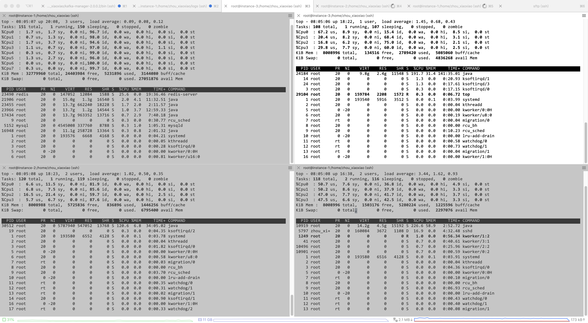
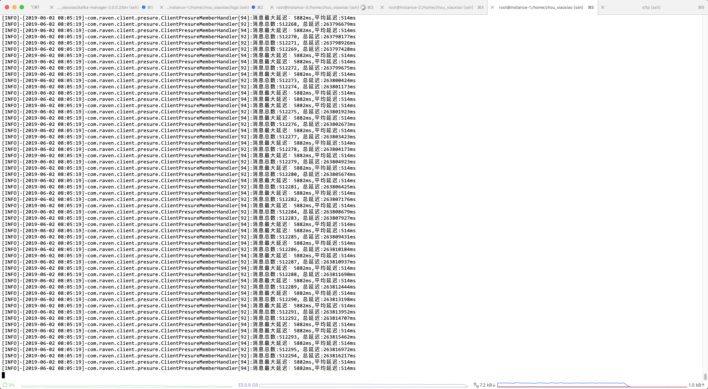

### 压测准备
* 8C32G: kafka(8G堆) zookeeper redis(默认配置) mysql(默认配置) zuul(1G堆) route(1G堆)
* 4C8G: access 分配堆内存6G
* 4C8G: group 分配堆内存6G
* 4C8G: client  创建2500长连接 修改linux最大文件句柄数为65535  client启动时分配堆内存6G 
  但是超过2600长连接之后就会报错too many open files,所以就以2500长连接为测试连接数
* 不要在kafka消费者线程中做任何耗时操作，将推送群消息改为异步
* 以下结果持续压测一分钟后截图

#### 2500长连接只维持心跳，access负载情况

#### 3000条每秒
* 如下图，acces load值为0.65，group为0.76

* 下图可见在3000/s的负载下，消息延迟情况

### 5000条每秒
* 如下图，acces load值为0.78，group为0.79

* 下图可见在5000/s的负载下，消息延迟情况

### 7000 条每秒
* 如下图，acces load值为1.45，group为1.02，此时access已达性能瓶颈

* 下图可见在7000/s的负载下，消息延迟情况

